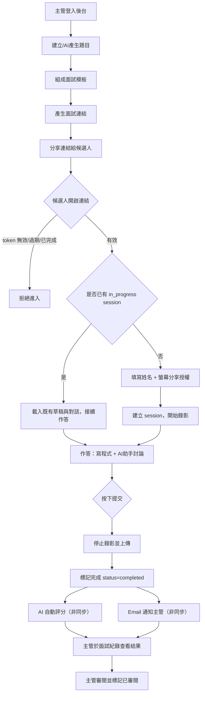

# 6. 流程圖與時序圖

> 回上一層：[README.md](./README.md)

## 6.1 系統整體流程圖

```mermaid
flowchart TD
    A[主管登入後台] --> B[建立/AI產生題目]
    B --> C[組成面試模板]
    C --> D[產生面試連結]
    D --> E[分享連結給候選人]
    E --> F{候選人開啟連結}
    F -- token 無效/過期/已完成 --> F1[拒絕進入]
    F -- 有效 --> G{是否已有 in_progress session}
    G -- 是 --> H[載入既有草稿與對話，接續作答]
    G -- 否 --> I[填寫姓名 + 螢幕分享授權]
    I --> J[建立 session，開始錄影]
    H --> K[作答：寫程式 + AI助手討論]
    J --> K
    K --> L{按下提交}
    L --> M[停止錄影並上傳]
    M --> N[標記完成 status=completed]
    N --> O[AI 自動評分（非同步）]
    N --> P[Email 通知主管（非同步）]
    O --> Q[主管於面試紀錄查看結果]
    P --> Q
    Q --> R[主管審閱並標記已審閱]
```

## 6.2 詳細時序圖

詳細的三張時序圖（主管建立面試、候選人完整作答、主管審閱）收錄於 [../面試平台-規格開發書.md 第 14 章](../面試平台-規格開發書.md)，此處不重複列出，避免兩份文件內容分岔、日後修改需同步兩處。
