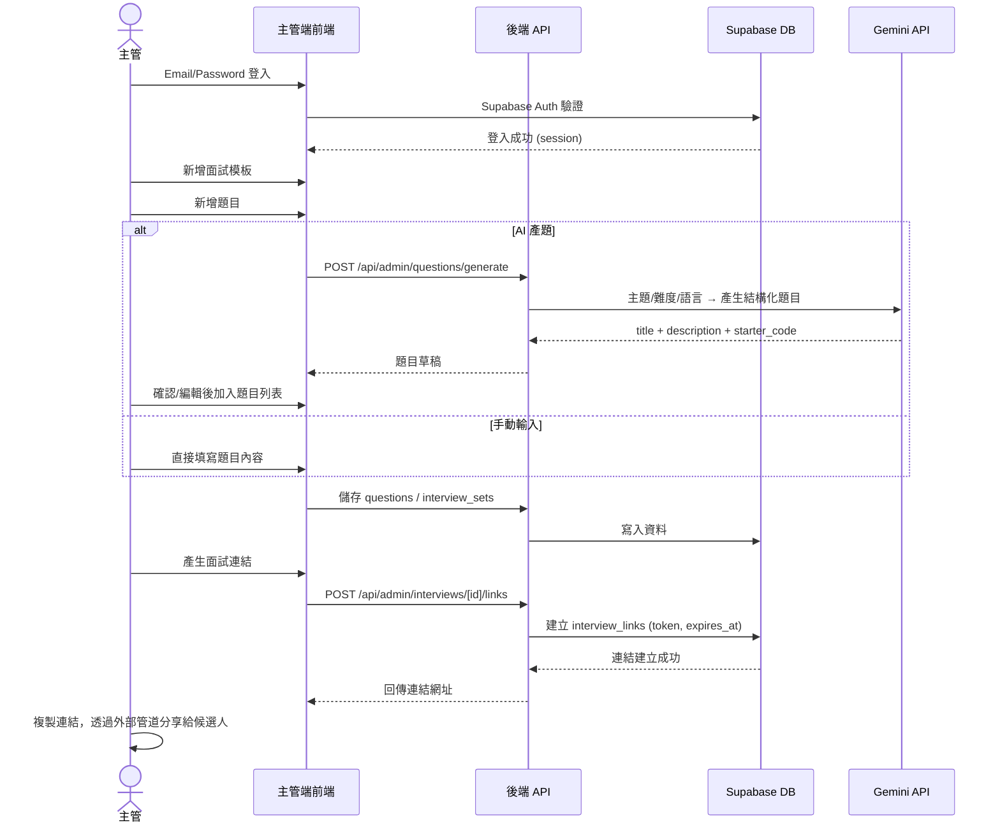
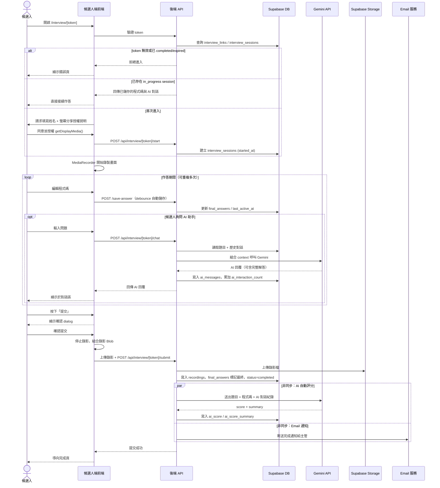
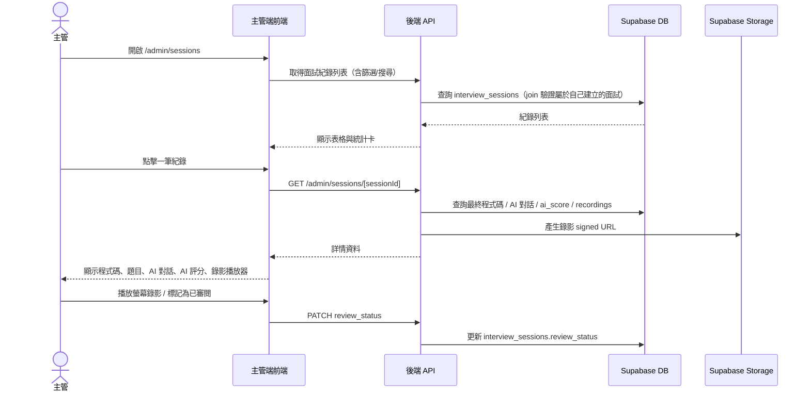

# 面試平台 規格開發書

> 本文件作為開發依據，可直接交給 Claude Code 進行開發。若有規格未涵蓋之細節，開發時可依此文件精神合理擴充。

---

## 1. 專案概述

一個線上技術面試平台，讓「主管端」建立題目與面試連結，「候選人端」透過連結完成程式撰寫面試，並可在過程中與 AI 助手互動討論。主管端可事後檢視候選人的最終程式碼、與 AI 的完整對話紀錄，以及螢幕錄影回放。

### 核心角色

| 角色 | 說明 | 是否需登入 |
|---|---|---|
| 主管 (Admin) | 建立/管理題目、產生面試連結、檢視面試紀錄 | 需要 |
| 候選人 (Candidate) | 透過連結進入、完成程式題、與 AI 討論、提交 | 不需要（以連結 token 識別） |

### 核心流程

**主管端：** 登入 → 建立題目（手動或 AI 產題）→ 組成一場面試 → 產生專屬連結 → 分享給候選人 → 候選人完成後於紀錄列表查看結果（程式碼 + AI 對話 + 錄影）

**候選人端：** 收到連結 → 開啟頁面（授權螢幕分享）→ 左側寫程式、右上看題目、右下與 AI 助手討論 → 按下提交 → 完成畫面

---

## 2. 技術棧

- **前端框架**：Next.js 14+（App Router）＋ TypeScript
- **樣式**：Tailwind CSS
- **後端**：Next.js Route Handlers（API Routes）
- **資料庫 / 認證 / 儲存**：Supabase（Postgres + Supabase Auth + Supabase Storage）
- **程式編輯器**：Monaco Editor（`@monaco-editor/react`），支援語法高亮
- **AI**：Google Gemini API（`@google/genai`），使用免費額度（Free Tier）模型
  - 用途一：AI 產題
  - 用途二：候選人端 AI 助手（輔助角色，非評分官）
- **螢幕錄影**：瀏覽器原生 `MediaRecorder` + `getDisplayMedia()`，錄製檔上傳至 Supabase Storage
- **Markdown 渲染**：題目描述以 Markdown 撰寫，前端用 `react-markdown` 渲染
- **Email 通知**：建議使用 Resend（或 Supabase 內建 SMTP）寄送候選人完成面試的通知信給主管
- **線上程式碼執行（Phase 2+）**：建議串接第三方 Sandbox 執行服務（例如 Judge0 API 或 Piston API），不自建執行環境

---

## 3. 角色與權限設計

- 主管使用 Supabase Auth（Email/Password 或 Magic Link）登入，登入後才可存取 `/admin/*` 所有頁面與 API。
- 候選人**不登入**，而是透過連結中的一次性 `token` 存取面試頁 `/interview/[token]`。所有候選人端的資料寫入（AI 對話、程式碼、錄影）都必須經過後端 API 驗證 token 有效性，**不可讓前端直接以 anon key 寫入資料庫**，避免被竄改或偽造提交。
- Supabase RLS（Row Level Security）：
  - `questions`、`interview_sets`、`interview_links` 僅該建立者（`admin_id = auth.uid()`）可讀寫。
  - `interview_sessions`、`ai_messages`、`recordings` 一般情況下只能透過 Service Role（後端 API）寫入；主管讀取時需 join 驗證是否為自己建立的面試。

---

## 4. 資料庫 Schema（Supabase / Postgres）

```sql
-- 主管資料（延伸 Supabase auth.users）
create table admins (
  id uuid primary key references auth.users(id) on delete cascade,
  name text,
  email text,
  role text default 'manager',       -- 技術主管 / 之後可擴充其他管理角色
  created_at timestamptz default now()
);

-- 主管全域 AI 預設設定（「AI 設定」頁面用，作為新面試模板的預設值）
-- 註：MVP 階段僅支援 Gemini 系列模型（使用免費額度），default_model 欄位先固定/單選；多模型（如 Claude、GPT-4o）選擇為 Phase 5+ 規劃，屆時再開放此欄位的可選值
create table ai_settings (
  admin_id uuid primary key references admins(id) on delete cascade,
  default_model text not null default 'gemini-flash-latest',
  default_system_prompt text,
  updated_at timestamptz default now()
);

-- 題目（本階段僅支援程式題，線上編輯器作答）
create table questions (
  id uuid primary key default gen_random_uuid(),
  admin_id uuid references admins(id) on delete cascade,
  title text not null,
  description text not null,         -- markdown 格式
  language text not null default 'javascript',
  difficulty text not null default 'medium', -- easy(簡單) / medium(中等) / hard(困難)
  time_limit_minutes int,            -- 單題建議作答時間
  starter_code text,                 -- 給候選人的起始程式碼
  test_cases jsonb,                  -- 測試案例，供 Phase 2+ 線上執行/測試使用，MVP 可留空
  is_ai_generated boolean default false,
  created_at timestamptz default now()
);

-- 面試模板（一份模板可包含多題，並產生一組連結給候選人使用）
create table interview_sets (
  id uuid primary key default gen_random_uuid(),
  admin_id uuid references admins(id) on delete cascade,
  title text not null,
  target_role text,                  -- 應徵職位，例如「前端工程師」
  question_ids uuid[] not null,      -- questions.id 陣列，依序作答
  time_limit_minutes int,            -- 整場總時間限制
  expires_at timestamptz,            -- 模板到期日（超過則所有相關連結失效）
  status text not null default 'draft', -- draft(草稿) / published(已發布) / active(進行中) / expired(已過期)
  ai_model text default 'gemini-flash-latest',   -- 此面試使用的 AI 模型
  ai_system_prompt text,             -- 此面試 AI 助手的角色與行為準則（可覆蓋全域預設）
  created_at timestamptz default now()
);

-- 面試連結（一個模板可重新產生/多筆連結，供不同候選人使用）
-- 註：連結非一次性，候選人可於 in_progress 狀態下重新開啟同一連結繼續作答，僅 completed / expired 才拒絕進入
create table interview_links (
  id uuid primary key default gen_random_uuid(),
  interview_set_id uuid references interview_sets(id) on delete cascade,
  token text unique not null,        -- 產生於連結中，例如 nanoid(24)
  candidate_name text,               -- 可預先綁定，或候選人進入時填寫
  candidate_email text,
  status text not null default 'pending', -- pending / in_progress / completed / expired
  expires_at timestamptz,            -- 連結自身有效期限（7/14/30/60 天可選）
  open_count int not null default 0, -- 開啟次數（用於連結使用統計）
  created_at timestamptz default now()
);

-- 應試者（跨面試彙整候選人資訊，供「應試者」頁面使用）
create table candidates (
  id uuid primary key default gen_random_uuid(),
  admin_id uuid references admins(id) on delete cascade,
  name text not null,
  email text,
  created_at timestamptz default now()
);

-- 候選人的一次作答 session
create table interview_sessions (
  id uuid primary key default gen_random_uuid(),
  link_id uuid references interview_links(id) on delete cascade,
  candidate_id uuid references candidates(id),
  candidate_name text,
  started_at timestamptz,
  submitted_at timestamptz,
  last_active_at timestamptz,        -- 每次自動儲存草稿時更新，供斷點續答判斷/顯示
  final_answers jsonb,               -- { questionId: code } 持續自動儲存的作答草稿，提交時視為最終結果
  status text not null default 'in_progress', -- in_progress / completed
  review_status text not null default 'pending', -- pending(待審閱) / reviewed(已審閱)
  ai_score numeric,                  -- AI 自動評分（面試結束後由 AI 依程式碼+對話產出，僅供主管參考）
  ai_score_summary text,             -- AI 評分理由摘要
  ai_interaction_count int not null default 0, -- AI 互動次數（用於紀錄列表統計）
  created_at timestamptz default now()
);

-- AI 對話紀錄（面試中，AI 為輔助候選人的助手角色）
create table ai_messages (
  id uuid primary key default gen_random_uuid(),
  session_id uuid references interview_sessions(id) on delete cascade,
  question_id uuid references questions(id),
  role text not null,                -- 'user' / 'assistant'
  content text not null,
  created_at timestamptz default now()
);

-- 螢幕錄影檔（若候選人中斷後重新進入，可能產生多筆片段，主管端依序播放）
create table recordings (
  id uuid primary key default gen_random_uuid(),
  session_id uuid references interview_sessions(id) on delete cascade,
  storage_path text not null,        -- Supabase Storage 路徑
  duration_seconds int,
  created_at timestamptz default now()
);
```

> 註：`interview_sets.status` 是「模板本身」的生命週期（草稿/已發布/進行中/已過期），與 `interview_links.status`／`interview_sessions.status`（個別候選人的作答進度）是兩個獨立狀態，畫面上分開顯示。

---

## 5. 功能規格

### 5.1 主管端（`/admin`，需登入）

**側邊欄導覽**：面試管理／面試紀錄（含待審閱數量紅點提示）／應試者／AI 設定／系統設定，底部顯示登入中的主管名稱與職稱。

**5.1.1 登入頁** `/admin/login`
- Email/Password 登入（Supabase Auth）

**5.1.2 面試管理** `/admin/interviews`（雙欄版面：左側面試模板列表 + 右側模板詳情）

左側列表：
- 顯示所有面試模板卡片：標題、應徵職位、狀態標籤（草稿 / 已發布 / 進行中 / 已過期）、題數、完成日期、總時間
- 搜尋框（依標題搜尋）＋ 狀態篩選 chips（全部/進行中/已發布/草稿/已過期）
- 右上「＋ 新增」建立新面試模板

右側詳情（點選左側項目後顯示，分三個 tab）：

1. **題目列表 tab**（預設）
   - 上方統計列：題目數量、總時間
   - 題目表格：序號（可拖曳排序）、標題、難度 badge、單題時間、是否 AI 產生（AI badge）、上移/下移、編輯、刪除
   - 「新增題目」：可手動輸入，或點右上角**「AI 產生題目」**按鈕 → 輸入職缺/技能主題、難度、程式語言 → 呼叫 Gemini API 產生結構化題目（標題＋描述＋起始程式碼）→ 主管確認/編輯後加入題目列表
   - 本階段僅支援程式題（線上編輯器作答）；問答題／選擇題暫不開發

2. **面試連結 tab**
   - 連結狀態卡：開啟次數、完成次數、完成率、目前狀態（進行中/已過期等）
   - 面試連結網址（唯讀輸入框 + 複製按鈕 + 開新分頁圖示）、到期日顯示
   - 連結設定：有效期限選項（7 / 14 / 30 / 60 天，單選按鈕群組）、面試時間限制（顯示，依題目設定加總或模板總時間）
   - 「重新生成連結」按鈕：產生新 token，舊連結立即失效（`interview_links` 新增一筆，舊筆標記過期）
   - 連結使用統計卡片（開啟次數 / 已完成 / 完成率）

3. **設定 tab**
   - 基本資訊：面試標題、應徵職位、總時間限制（分鐘）、到期日
   - AI 設定：AI 模型下拉選單（MVP 階段固定為 Gemini，選單先做但選項單一，Phase 5+ 才開放多模型）、AI 系統提示詞文字框（定義 AI 在面試過程中的角色與行為準則，預設帶入「AI 設定」頁的全域預設值，可針對此面試覆蓋）
   - 「儲存設定」按鈕

**5.1.3 面試紀錄** `/admin/sessions`
- 上方儀表板統計卡：總面試場次、待審閱筆數、平均作答時間、平均 AI 互動次數、平均 AI 評分
- 搜尋框（應試者姓名/Email）＋ 狀態篩選 ＋ 面試模板篩選
- 紀錄表格欄位：應試者（姓名+Email）、面試題組、職位、提交時間、作答時長、AI 互動次數、AI 評分、審閱狀態（待審閱／已審閱，可點擊切換）
- 點擊一筆紀錄進入詳情頁

**5.1.4 面試詳情頁** `/admin/sessions/[sessionId]`
- 左側：候選人最終程式碼（唯讀 Monaco Editor，依題目切換分頁）
- 右上：題目內容（唯讀）
- 右下：AI 對話紀錄（唯讀 chat log，依題目分段）
- AI 自動評分卡：分數 + 評分理由摘要（`ai_score` / `ai_score_summary`，僅供主管參考，非最終定論；MVP 先單一總分，多維度拆分列 Phase 5+）
- 螢幕錄影播放器（讀取 Supabase Storage signed URL，若有多段錄影依序列出播放）
- 「標記為已審閱」操作，更新 `review_status`

**5.1.5 應試者** `/admin/candidates`
- 彙整所有曾透過連結作答的候選人（跨面試模板），可查看該候選人參與過的所有面試場次與各自結果
- 支援搜尋姓名/Email

**5.1.6 AI 設定** `/admin/ai-settings`
- 設定全域預設 AI 模型與預設 System Prompt（新建面試模板時自動帶入，可個別覆蓋）
- MVP 階段模型固定為 Gemini（免費額度），欄位保留擴充空間以便日後開放多模型選擇

**5.1.7 系統設定** `/admin/settings`
- 帳號資訊、通知偏好等（依實際需求擴充）

### 5.2 候選人端（`/interview/[token]`，免登入）

**5.2.1 進入頁**
- 驗證 token（有效性 / 是否過期 / 是否已完成）
- 若未綁定姓名，請候選人填寫姓名（Email 可選）
- 若該連結已有 `in_progress` 的 session（候選人先前中斷後重新打開連結）：直接載入已儲存的程式碼與 AI 對話紀錄，讓候選人接續作答，不重新開始
- 說明將進行螢幕錄影，取得同意後才可繼續，並請求 `getDisplayMedia()` 權限（重新進入時視為開始新一段錄影片段）
- 首次進入時點擊「開始面試」→ 建立 `interview_sessions` 記錄，`started_at` 寫入，開始錄影

**5.2.2 作答頁**（三欄式版面）
- **左側**：Monaco Code Editor，依當前題目語言設定語法高亮，程式碼定期自動儲存至 `interview_sessions.final_answers` 與 `last_active_at`（例如每 10–30 秒或每次編輯 debounce 後），確保中斷後可從雲端恢復，不僅依賴 localStorage
- **右上**：題目描述（Markdown 渲染，唯讀），若多題可切換 tab
- **右下**：AI 助手對話區
  - 輸入框 + 對話紀錄
  - AI 角色定位為「輔助面試者的助手」：可自由回答候選人的疑問、協助釐清思路，**也可視候選人需求直接提供完整解答程式碼**（不強制保留答案），實際尺度由該面試的 `ai_system_prompt` 決定
  - 每則訊息即時寫入 `ai_messages`，並累加 `ai_interaction_count`
- 頂部：可選計時器（若面試場次設有 `time_limit_minutes`）、錄影中指示燈
- **提交按鈕**：彈出確認 dialog → 停止錄影並上傳 → `final_answers` 標記為最終版本 → `submitted_at` 與 `status = completed` → 觸發 AI 自動評分與 Email 通知主管（非同步）→ 導向完成頁

**5.2.3 完成頁**
- 顯示「面試已完成，感謝參與」等訊息，該連結後續不可再進入作答（`status = completed`）

---

## 6. AI 整合設計

### 6.1 AI 產題（主管端使用）
- 輸入：主題/職缺、難度、程式語言、（可選）額外要求
- System Prompt 範例方向：要求 Gemini 回傳結構化 JSON（`title`, `description`（markdown）, `starter_code`, `difficulty`），可搭配 Gemini 的 `responseMimeType: "application/json"` / `responseSchema` 設定強制結構化輸出
- 後端 API Route：`POST /api/admin/questions/generate`

### 6.2 AI 助手（候選人端使用）
- Context 組成：題目描述 + 候選人目前程式碼 + 該題的歷史對話
- System Prompt 方向：定位為「面試輔助助手」，語氣友善，**可依候選人需求直接提供完整解答程式碼**（本專案定調 AI 為輔助角色，不強制隱藏答案），實際 prompt 取自該面試模板 `interview_sets.ai_system_prompt`（若未設定則採 `ai_settings` 全域預設）
- 後端 API Route：`POST /api/interview/[token]/chat`（後端驗證 token 有效後才呼叫 Gemini API 並寫入 `ai_messages`）

### 6.3 AI 自動評分（候選人提交後，主管端使用）
- 候選人按下提交後，後端非同步觸發一次評分呼叫，輸入為：題目內容、候選人最終程式碼、與 AI 助手的完整對話紀錄
- 目的是**輔助主管快速掌握重點**，非最終錄取依據：MVP 階段輸出單一總分 `score`（0–100）與 `summary` 評分理由摘要；多維度拆分評分（例如程式邏輯、與 AI 互動品質分開給分）列入 Phase 5+
- 結果寫入 `interview_sessions.ai_score` / `ai_score_summary`，於面試紀錄列表與詳情頁顯示
- 後端 API Route：`POST /api/interview/[token]/submit` 內觸發，或另立 `POST /api/admin/sessions/[sessionId]/score` 供重新評分

### 6.4 AI 模型設定
- MVP 階段固定使用 Gemini 系列模型（免費額度，例如 `gemini-flash-latest`）；`ai_settings.default_model` / `interview_sets.ai_model` 欄位保留，UI 下拉選單先做但選項單一
- 建議統一透過後端封裝的 AI client 呼叫（`/lib/gemini`），依 `ai_model` 欄位切換模型參數，方便 Phase 5+ 擴充其他供應商（如需支援 Claude / GPT 系列，需另外整合對應 SDK 並在 `/lib` 下新增對應封裝）
- 免費額度注意事項：Gemini API 免費層級有請求頻率（RPM）與每日配額（RPD）限制，需在候選人端 AI 對話與主管端 AI 產題/評分功能加上基本節流與錯誤提示（超過額度時給予友善訊息，避免直接顯示 API 錯誤）

---

## 7. 線上程式碼執行與完成通知

### 7.1 線上程式碼執行（Phase 5+，MVP 不開發）
- 候選人作答頁加入「執行/測試」按鈕，將程式碼與（可選）`questions.test_cases` 送至後端
- 後端串接第三方 Sandbox 執行服務（例如 Judge0 API 或 Piston API）取得 stdout/stderr/執行結果，回傳前端顯示，不在候選人瀏覽器本機執行（避免安全風險）
- 後端 API Route：`POST /api/interview/[token]/run`
- 需設定執行逾時與資源限制，避免濫用；此功能非本次 MVP 範圍，待核心流程穩定後再評估導入

### 7.2 完成通知
- 候選人成功提交後，後端非同步寄送 Email 通知該面試模板的建立者（`admins.email`）
- 信件內容建議包含：候選人姓名、面試標題、提交時間、面試詳情頁連結
- 建議使用 Resend（或 Supabase 整合的 SMTP）作為寄信服務
- 後端 API Route：於 `POST /api/interview/[token]/submit` 流程中觸發，失敗不應阻塞候選人的提交結果

---

## 8. 螢幕錄影實作

1. 候選人同意後，前端呼叫 `navigator.mediaDevices.getDisplayMedia({ video: true })` 取得畫面串流
2. 使用 `MediaRecorder` 錄製為 `webm`，可設定每隔一段時間 `ondataavailable` 收集 chunk
3. 提交時：停止錄製 → 組合 Blob → 呼叫後端取得 Supabase Storage 上傳簽章網址（或後端代為上傳）→ 寫入 `recordings` 表
4. 若中途候選人取消螢幕分享權限，前端需偵測 `track.onended` 並提示重新授權（避免面試中斷錄影）
5. 主管端播放：後端產生 Supabase Storage **signed URL**（限時有效）供 `<video>` 標籤播放
6. 因連結允許中斷後繼續，候選人重新進入時視為開始新一段錄影，`recordings` 表可對應同一 `session_id` 存在多筆，主管端依 `created_at` 依序列出播放

---

## 9. 安全性設計

- 連結 `token` 使用高隨機性字串（如 `nanoid(24)`），不可猜測
- 候選人端所有資料寫入一律經由後端 API 驗證 token 狀態（`pending`/`in_progress` 才可寫入，`completed`/`expired` 一律拒絕；連結非一次性，`in_progress` 狀態允許重新整理/重新開啟繼續作答）
- 連結可設定到期時間，過期自動視為 `expired`
- Supabase RLS 確保主管只能存取自己建立的面試場次與其對應的候選人紀錄
- AI API 呼叫需在後端進行（不可將 Gemini API Key 暴露於前端）
- 建議對候選人端 API（尤其 AI 對話）加上基本 rate limiting，避免濫用
- Email 通知與（未來的）程式碼執行服務的第三方 API Key 皆僅存於後端環境變數，不暴露於前端

---

## 10. 建議專案目錄結構

```
/app
  /admin
    /login
    /interviews
      /[id]              -- 面試模板詳情（題目列表/面試連結/設定 三個 tab）
    /sessions
      /[sessionId]        -- 面試詳情頁
    /candidates
    /ai-settings
    /settings
  /interview
    /[token]
  /api
    /admin
      /interviews
        /route.ts
        /[id]/route.ts
        /[id]/questions/route.ts
        /[id]/questions/generate/route.ts   -- AI 產生題目
        /[id]/links/route.ts                -- 重新生成連結
      /sessions
        /[sessionId]/route.ts
        /[sessionId]/score/route.ts         -- AI 重新評分
      /candidates/route.ts
      /ai-settings/route.ts
    /interview
      /[token]
        /start/route.ts                     -- 建立或恢復 session
        /chat/route.ts
        /save-answer/route.ts               -- 定期自動儲存程式碼草稿
        /submit/route.ts                    -- 提交，觸發 AI 自動評分 + Email 通知
        /upload-recording/route.ts
        /run/route.ts                       -- 線上程式碼執行（Phase 5+）
/components
  /editor (Monaco 封裝)
  /chat (AI 對話 UI)
  /admin (主管端共用元件：模板卡片、統計卡、題目表格等)
/lib
  /supabase (client / server / admin client)
  /gemini (Google Gemini SDK 封裝：產題 / 對話 / 評分 三種 prompt)
  /email (Resend 封裝)
/types
```

---

## 11. 開發階段建議（分階段實作，方便逐步驗收）

**Phase 1（MVP 核心流程）**
- 主管登入、建立面試模板（程式題）、題目列表管理、產生面試連結
- 候選人透過連結進入、Monaco Editor 撰寫程式、程式碼定期自動存檔、提交存最終作答
- 連結支援中斷後重新進入繼續作答（非一次性）
- 面試紀錄列表（基本欄位）與詳情頁可查看最終程式碼（不含 AI 對話、不含錄影、不含 AI 評分）

**Phase 2（加入 AI 互動）**
- AI 產題功能（題目列表 tab 的「AI 產生題目」）
- 候選人端 AI 助手對話區，訊息存入 DB，`ai_interaction_count` 累計；AI 可視需求直接提供完整解答
- 主管端詳情頁顯示 AI 對話紀錄
- AI 設定頁（全域預設 Gemini 模型與 prompt）＋ 面試模板設定 tab 的覆蓋設定

**Phase 3（加入錄影 + 完成通知）**
- 候選人端螢幕錄影 + 上傳（支援中斷後多段錄影）
- 主管端詳情頁加入錄影播放器
- 候選人提交後 Email 通知主管

**Phase 4（AI 評分 + 管理功能）**
- 提交後觸發 AI 自動評分（單一總分 + 摘要），寫入並顯示於紀錄列表與詳情頁
- 面試紀錄儀表板統計卡（平均作答時間、平均 AI 互動、平均 AI 評分）
- 面試連結管理：有效期限選項、重新生成連結、連結使用統計
- 應試者彙整頁面（跨面試模板查詢候選人歷史紀錄）
- 審閱狀態（待審閱/已審閱）標記與篩選

**Phase 5（進階功能，視需求評估）**
- 線上程式碼執行/測試（串接 Judge0 / Piston 等 Sandbox 服務）
- AI 模型可選（開放 GPT 等其他供應商，需另整合對應 SDK）
- AI 評分多維度拆分

**Phase 6（優化）**
- 整場/單題計時器、逾時自動提交
- 面試模板狀態自動轉換（草稿→已發布→進行中→已過期）
- 面試紀錄匯出（PDF/CSV）

---

## 12. 開發決策記錄（已與需求方確認）

1. **AI 助手邊界**：允許 AI 直接提供完整解答程式碼，不強制保留答案
2. **線上程式碼執行**：需要，但列入 Phase 5，MVP 不開發
3. **面試連結**：允許中斷後重新進入繼續作答，非一次性使用
4. **完成通知**：候選人提交後需 Email 通知主管（Phase 3）
5. **AI 模型選擇**：未來要開放多模型可選（例如 Claude / GPT-4o），但 MVP 先固定使用 Gemini（免費額度），欄位與 UI 保留擴充空間（Phase 5）
6. **AI 自動評分呈現**：未來要支援多維度拆分評分，MVP 先做單一總分即可（Phase 4 做單一總分，Phase 5 視需要拆分維度）
7. **題型範圍**：本階段不開發問答題與選擇題，僅支援程式題（線上編輯器作答）

---

## 13. 環境變數（範例）

```
NEXT_PUBLIC_SUPABASE_URL=
NEXT_PUBLIC_SUPABASE_ANON_KEY=
SUPABASE_SERVICE_ROLE_KEY=
GOOGLE_GENERATIVE_AI_API_KEY=   # Gemini API 金鑰（免費額度）
RESEND_API_KEY=                 # Email 通知用，Phase 3 起需要
# CODE_EXECUTION_API_KEY=       # 線上程式碼執行用，Phase 5 才需要
```

---

## 14. 時序圖與使用者情境

### 14.1 時序圖一：主管建立面試並產生連結



### 14.2 時序圖二：候選人完整作答流程（含 AI 對話、自動儲存、螢幕錄影）



### 14.3 時序圖三：主管審閱候選人結果



### 14.4 使用者情境（User Scenarios）

**情境 A：主管建立一場新面試並邀請候選人**
> 小美是技術主管，需要招募一位前端工程師。她登入主管後台，建立新的面試模板「前端工程師面試」，點擊「AI 產生題目」輸入「React + TypeScript，中等難度」，AI 產生兩題結構化題目讓她確認並微調起始程式碼。接著她切到「面試連結」tab，設定連結 30 天有效期限，產生連結後複製並透過 Email 寄給候選人小華。

**情境 B：候選人完整完成一場面試**
> 小華收到面試連結，點開後填寫姓名，閱讀螢幕錄影同意說明並授權畫面分享，點擊「開始面試」。左側撰寫程式碼時，右下角詢問 AI 助手「這題的邊界情況要考慮什麼？」，AI 給予提示。小華完成兩題後按下提交，確認 dialog 後系統停止錄影並上傳，畫面導向「面試已完成」頁面。幾分鐘後小美收到 Email 通知，並在紀錄列表看到 AI 自動評分與摘要。

**情境 C：候選人中途離開後重新接續作答**
> 小華在作答到一半時不慎關閉瀏覽器分頁。他重新打開同一個面試連結，系統偵測到該連結已有 `in_progress` 的 session，直接載入他先前寫的程式碼與 AI 對話紀錄，並開始新一段錄影片段，讓他從中斷處繼續作答，不需要重新開始。

**情境 D：主管審閱已完成的面試並標記狀態**
> 小美在「面試紀錄」頁看到待審閱數量的紅點提示，點入小華的紀錄詳情頁，左側看最終程式碼、右下看 AI 對話全文、上方看 AI 自動評分與理由摘要，並播放螢幕錄影確認作答過程。確認無誤後，她點擊「標記為已審閱」，該筆紀錄的審閱狀態更新為已審閱。

**情境 E：連結過期或候選人重複進入已完成的面試**
> 另一位候選人小強因為拖延太久才點開連結，此時連結已超過到期日；系統顯示連結已過期，無法進入作答。另一種情況是小華在提交後又點了一次舊的面試連結，系統偵測到該 session 狀態為 `completed`，同樣拒絕進入並顯示對應訊息，避免重複作答或竄改已提交的結果。
